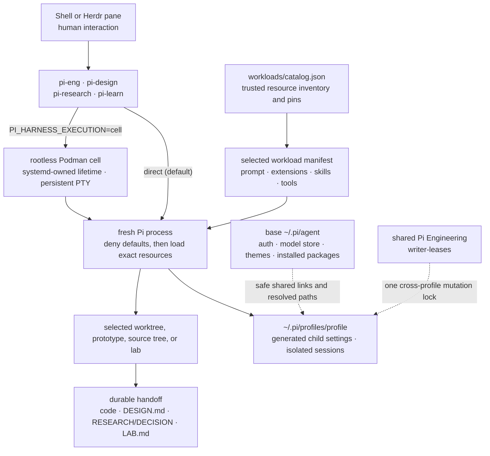

# Pi Harness

Pi Harness starts Pi as one of four small, deterministic workload environments:

```text
pi-eng        engineering and delivery
pi-design     product design and prototypes
pi-research   read-only evidence work
pi-learn      reproducible learning labs
```

Each command creates a fresh Pi process with one workload prompt, an exact extension and skill set, an explicit tool allowlist, and a separate session namespace. This is process construction, not an in-session mode switch: changing workloads means handing off an artifact and starting the corresponding command.

## Architecture



The layers have deliberately narrow jobs:

- **Herdr** owns panes and human attention. In direct mode it also supervises Pi; in cell mode it is only an attach client and does not own Pi's lifetime.
- **A Pi cell** gives long-running work a rootless Podman PTY started by the user systemd manager, outside Herdr's process tree.
- **The launcher** owns workload selection and Pi process configuration.
- **A system prompt** defines identity, evidence standards, authority, artifacts, and stop conditions.
- **A skill** supplies an on-demand method inside that identity.
- **An extension** supplies executable capability or bounded orchestration.
- **Files and Git state** carry results between workloads; hidden cross-profile conversation state does not.

### Catalog versus loaded resources

[workloads/catalog.json](workloads/catalog.json) is the approved inventory: it maps stable names to local extension/package paths and records expected package versions. Being in the catalog does **not** load a resource.

The selected file under [workloads/](workloads/) names the extensions, skills, tools, prompt behavior, and child-process resources for one launch. The launcher starts Pi with `--no-extensions`, `--no-skills`, `--no-prompt-templates`, and `--no-approve`, then passes only that manifest's explicit resources. Attempts to override controlled isolation flags on the command line are rejected.

Before creating or refreshing any profile state, every launch probes `pi --version` and requires the exact catalog version. An ambient `pi update`, PATH change, or partial fleet rollout therefore fails closed instead of silently running an untested core against the workload contracts.

The separate profile home matters for subagents. A parent Pi process receives exact CLI resources, while a `pi-subagents` child discovers resources from `PI_CODING_AGENT_DIR`. Pi Harness therefore generates a minimal `settings.json` for each profile's children instead of letting them rediscover the global package set.

## Workload contracts

| Command | Prompt | Loaded capability | Context and mutation boundary | Handoff |
|---|---|---|---|---|
| `pi-eng` | Appends the engineering contract to Pi's default prompt | Pi Engineering, web retrieval, Plannotator, hashline editing, LSP | Project context enabled; mutation only in the selected Git worktree; Pi Engineering retains one writer | Working code plus fresh verification and delivery notes |
| `pi-design` | Replaces the default with the design contract | Web retrieval, design and librarian skills, plus the `/chrome` authorization command | Project context enabled; production is read-only unless an explicit prototype is requested in a designated area | `DESIGN.md`, references, screenshots, and optional prototype |
| `pi-research` | Replaces the default with the evidence-research contract | Read-only web tools and `/research`; Engineering is loaded only as the trusted subagent runtime host | Parent project context disabled; no shell or mutation tools | A `RESEARCH.md`- or `DECISION.md`-formatted response for a user or write-capable profile to persist |
| `pi-learn` | Replaces the default with the learning-scientist contract | Web retrieval plus the progressive-disclosure `learning-lab` skill | Project context disabled; writes and execution only in a designated lab/container, never a production checkout | `LAB.md`, experiment artifacts, implementation, and rerun evidence |

Web retrieval is the small cross-cutting capability. Pi Chrome is loaded only for design, and its `chrome_*` tools become active only after `/chrome authorize`; their schemas do not occupy the startup context. Pi Engineering is not loaded for design or learning. Learning remains single-agent until real usage demonstrates that another orchestration layer is worth its cost.

Pi Chrome controls an existing authorized Chrome profile on the **same host as Pi**. In a headless cloud/SSH VM, `pi-design` still has web retrieval, but Chrome automation requires a browser and bridge running on that VM (or a future remote-browser integration). It does not automatically reach a Chrome session on your local desktop.

The current Research package depends on Pi Engineering to host the pinned `pi-subagents` runtime. Its Engineering model tools are absent from the Research allowlist, so the Research parent remains read-only. Current Research child manifests explicitly inherit project context, however, even though the parent starts with `--no-context-files`. Until that package policy is tightened, run `pi-research` from a neutral research directory when inspecting an untrusted repository and refer to the repository by path.

## Requirements and setup

The catalog currently targets Node 24 or newer and Pi `0.82.1`; `herdr` must also be available on `PATH` (or configured with `PI_HARNESS_HERDR_BIN`). It expects the pinned packages and local Engineering/Research package links already present under the base Pi agent directory (normally `~/.pi/agent`). Authenticate once with bare `pi` and `/login` before using the harness: profile generation intentionally refuses to invent or copy missing authentication, model-store, or theme state. `pi-doctor` reports every missing path or version mismatch.

Install the launch commands into `~/.local/bin` and verify the complete harness:

```sh
cd /path/to/pi-harness
npm run install:launchers
pi-doctor
```

Make sure `~/.local/bin` is on `PATH`. Launcher installation is conservative: it creates or verifies known symlinks and refuses to replace an unrelated file or retarget an existing symlink.

`pi-doctor` validates the strict manifests, Node, Pi and Herdr availability, catalog paths and package pins, skills, profile homes, exact active tool sets, and required slash commands in real headless Pi processes. Useful narrower checks are:

```sh
pi-doctor research
pi-doctor --no-smoke
pi-eng --doctor
pi-learn --print-agent-dir
```

`--no-smoke` skips runtime probes; use it for a quick structural check, not final verification.

## Running work

Start interactively or pass an initial Pi prompt:

```sh
pi-eng
pi-design "Audit the onboarding flow and prepare DESIGN.md"
pi-research "Compare the architectural tradeoffs in these two repositories"
pi-learn "Study this paper and reproduce one central claim on a tiny local example"
```

The generic form is also available:

```sh
pi-run eng
pi-run design
pi-run research
pi-run learn
```

### Persistent cells for VPS work

Direct execution remains the default. On a Linux VPS, persistent cell mode moves Pi out of the SSH/Herdr process tree, so closing a pane or losing the client kills only `podman attach`; the Pi process and its child jobs keep running.

Install rootless Podman and enable the user manager once. Debian-family hosts can use:

```sh
sudo apt-get install podman uidmap passt slirp4netns fuse-overlayfs
sudo loginctl enable-linger "$USER"
npm run cell:build
pi-cell doctor
```

Then opt the workload launchers into cells:

```sh
export PI_HARNESS_EXECUTION=cell
pi-eng
pi-learn "Reproduce the central experiment"
```

The normal launcher chooses a deterministic cell name from the profile and canonical workspace. Invoking it again with no new Pi arguments reattaches to an already-running exact cell. It refuses to discard or inject a second prompt. Management is explicit:

```sh
pi-cell list
pi-cell status NAME
pi-cell attach NAME       # Ctrl-] detaches without stopping Pi
pi-cell logs NAME
pi-cell logs NAME --follow
pi-cell stop NAME         # explicit graceful stop
pi-cell remove NAME       # stopped runtime only; home and sessions remain
```

Engineering cells publish only their deterministic Plannotator port, bound to VPS loopback. `pi-cell status NAME` prints it. From your local machine, forward the same port before opening the review URL:

```sh
ssh -L PORT:127.0.0.1:PORT radar
```

No port is exposed on the VPS's public interfaces. Pi Chrome is different: its companion controls a browser on Pi's own host. Use `pi-design` in direct mode when you need an existing browser bridge; a VPS cell still has the profile's ordinary web-retrieval tools but cannot control Chrome on your laptop.

For a named or detached launch:

```sh
pi-cell run eng --name api-migration --detach -- "Implement the approved migration"
pi-cell run research --workspace /srv/source --detach
```

A stopped cell is never automatically restarted, including after a reboot. Restart policies could replay a mutating prompt, so recovery is intentionally deliberate: inspect its logs, remove the stopped runtime, then launch again with the appropriate profile-local `-r` or session ID. The cell image uses an immutable Node base digest, contains exact Pi plus a compact Node/Python/build toolchain, and carries a deterministic harness-payload label. A stale image fails closed after any harness change. Projects needing Rust, CUDA, databases, or other runtimes should use a reviewed derived image selected through `PI_HARNESS_CELL_IMAGE`; the launcher still enforces the same image labels, mounts, and lifecycle.

Ordinary Pi arguments such as model selection and thinking level pass through. `-c`/`--continue`, `-r`/`--resume`, and profile-local session IDs remain available. Explicit `--session` and `--fork` paths are accepted only when they resolve inside the selected profile's `sessions/` directory; cross-profile paths are rejected. Resource, prompt, tool, context, approval, and session-directory flags are owned by the workload manifest and cannot be overridden from the launcher command line.

## Profile homes and shared state

In direct mode, each workload is materialized under:

```text
~/.pi/profiles/
├── eng/
├── design/
├── research/
└── learn/
```

Each profile has its own generated `settings.json` and `sessions/`. The launcher sets both `PI_CODING_AGENT_DIR` and `PI_CODING_AGENT_SESSION_DIR`, so parent and child processes stay in the same workload boundary.

Each cell instead keeps the same profile layout inside its private retained home at `~/.local/state/pi-harness/cells/<name>/home/`. This prevents two independent long-running tasks from sharing session history or generated settings.

Four resources are intentionally linked to the base agent directory:

- `auth.json`
- `models-store.json`
- `themes/`
- `workbench/writer-leases/`

The first three avoid duplicating credentials and model/UI configuration in direct profiles. In direct mode, the writer-lease link ensures separate profile homes cannot accidentally create separate Pi Engineering write locks. A cell instead seeds private `0600` auth and model-store copies so OAuth refresh can persist without giving the container write access to host credentials. It also uses a cell-local writer lease because PID-based liveness cannot safely cross PID namespaces; the host cell manager allows only one retained mutation-capable cell per canonical Git worktree. Generated profile settings inherit non-resource base settings, force project trust to `never`, remove all global resource arrays, and add only the child extensions/packages declared by the selected workload. The harness also resets each generated profile's trust store on launch; Engineering specialist children independently reject project-local trust, so an earlier `/trust` decision cannot widen a child process.

Direct mode provides context and capability isolation, not operating-system isolation. Cell mode adds a rootless container boundary with a read-only image, an unprivileged init/subreaper, no privilege escalation, no host socket, and only the selected workspace, verified dependency closure, cell-private state, and cell-local writer leases mounted. The immutable bootstrap briefly receives only network-administration and identity-drop capabilities: it installs deny routes for common GCE, AWS, Azure, and Alibaba metadata endpoints, empties its capability bounding set, drops to the caller's keep-id UID, and only then becomes the cell's init. Rootless pasta's special host-loopback mapping is explicitly disabled. The entrypoint verifies that inherited, permitted, effective, and ambient capabilities are all zero before reading the launch request. Dynamic mounts that could shadow the bootstrap or runtime are rejected. The complete host home, host auth/model files, SSH agent, SSH keys, Docker/Podman socket, and devices are not mounted. Only Engineering's Plannotator port is published, on host loopback.

Cells retain general outbound network access for model, package, and web tools. Blocking known cloud metadata endpoints closes the VPS credential path; it is not a domain allowlist, traffic recorder, or complete hostile-code/egress sandbox. Use a dedicated VM or a separately reviewed filtered-egress network when executing adversarial code.

Portable installations can override paths without editing manifests:

| Variable | Default | Purpose |
|---|---|---|
| `PI_HARNESS_BASE_AGENT_DIR` | `~/.pi/agent` | Base auth, settings, installed resources, and writer leases |
| `PI_HARNESS_PROFILES_DIR` | `~/.pi/profiles` | Generated workload homes and sessions |
| `PI_HARNESS_SHARED_SKILLS_DIR` | `~/.agents/skills` | Cross-cutting skill source |
| `PI_HARNESS_PI_BIN` | `pi` | Pi executable |
| `PI_HARNESS_HERDR_BIN` | `herdr` | Herdr executable checked by the doctor |
| `PI_HARNESS_BIN_DIR` | `~/.local/bin` | Installed launcher symlinks |
| `PI_HARNESS_HOME_DIR` | OS home directory | Root used to derive the defaults above |
| `PI_HARNESS_EXECUTION` | direct | Set to `cell` on Linux to make `pi-<profile>` create or attach persistent cells |
| `PI_HARNESS_CELLS_DIR` | `~/.local/state/pi-harness/cells` | Retained cell manifests, private homes, sessions, and workspace leases |
| `PI_HARNESS_CELL_IMAGE` | `localhost/pi-harness-cell:0.1.0` | Reviewed local image used for new cells |
| `PI_HARNESS_PODMAN_BIN` | `podman` | Rootless Podman executable |
| `PI_HARNESS_SYSTEMD_RUN_BIN` | `systemd-run` | User-systemd handoff used to start the detached container outside Herdr |

## Herdr lifecycle and restore boundary

Run one explicit `pi-<profile>` command in each Herdr pane. In direct mode, Herdr remains the outer supervisor through normal screen/process detection and [detach/reattach](https://herdr.dev/docs/session-state/). In cell mode, Herdr attaches to a Podman-managed PTY and may disappear without taking Pi with it. Rootless Podman supports reattaching to a detached TTY, and the attach client uses `--sig-proxy=false` so client lifecycle signals are not forwarded into the container ([Podman run/attach documentation](https://docs.podman.io/en/latest/markdown/podman-run.1.html)).

Pi Harness deliberately does **not** load [Herdr's official Pi lifecycle extension](https://herdr.dev/docs/integrations/#pi). `--no-extensions` suppresses any global installation, and the workload manifests do not opt it back in. This keeps normal profiled sessions out of Herdr's native agent-restore path; no global uninstall or restore-disable step is required.

The reason is fidelity: the current native restore invokes bare `pi --session ...`, bypassing `pi-<profile>`. It cannot reconstruct the workload prompt, extensions, skills, tools, or agent home after a full Herdr server restart. In direct mode, use Herdr detach/reattach while the process remains alive. In cell mode, use `pi-cell attach NAME`; cell state lives under that cell's private home. If Pi itself has exited, relaunch deliberately with the matching profile and a profile-local session ID or `-r` after inspecting and removing the stopped runtime.

Treat the official Pi integration as opt-in only after a profile-aware resume helper exists. Installing it globally is harmless to these deny-by-default launches, but adding it to a workload would reintroduce the native-restore caveat. The doctor warns when it finds the global integration file so this distinction remains visible.

## Artifact handoffs

Keep profile crossings explicit and reviewable:

```text
pi-research  -> RESEARCH.md / DECISION.md-formatted response
pi-design    -> DESIGN.md + references/prototype
pi-learn     -> LAB.md + reproducible experiment artifacts
pi-eng       -> code + tests + delivery evidence
```

Research is intentionally unable to persist its own report. The user can accept it, or a write-capable profile can save it in the chosen workspace. Design authority does not silently become production implementation authority. A successful learning experiment becomes engineering input only after its assumptions and reproducibility limits are recorded.

## Why tool loading is static for now

Pi supports dynamic tool activation, but it solves tool-schema pressure rather than extension isolation. Loading an extension and merely hiding its tools still executes privileged extension code. These four profiles have small enough startup tool sets that static manifests are easier to audit, reproduce, cache, and diagnose.

The deliberate exception is Pi Chrome's own authorization gate in `pi-design`: the extension and `/chrome` command load with the profile, while `chrome_*` tools activate only after authorization. The harness does not add another generic tool-search or mode-switching layer around it.

Add deferred loading only after measurements show that one profile's inactive schemas materially consume context. Keep the process-start profile boundary even then; a tool loader should optimize a profile, not turn one Pi process back into a universal harness.

## Changing the harness

- Change identity and authority in [system-prompts/](system-prompts/).
- Change a workload's resource selection in its strict JSON manifest under [workloads/](workloads/).
- Add an approved extension/package or skill path and version to [workloads/catalog.json](workloads/catalog.json) before selecting it.
- Keep reusable learning method in [skills/learning-lab](skills/learning-lab/), not in the learning system prompt.
- Do not edit generated profile settings; the launcher refreshes them from the manifests.
- Run `npm test` and `pi-doctor` after every manifest, launcher, prompt, or resource change.

Pi's relevant native mechanisms are documented in its [CLI usage](https://pi.dev/docs/latest/usage), [packages](https://pi.dev/docs/latest/packages), [extensions](https://pi.dev/docs/latest/extensions), [skills](https://pi.dev/docs/latest/skills), [environment variables](https://pi.dev/docs/latest/environment-variables), and [security model](https://pi.dev/docs/latest/security) references.
